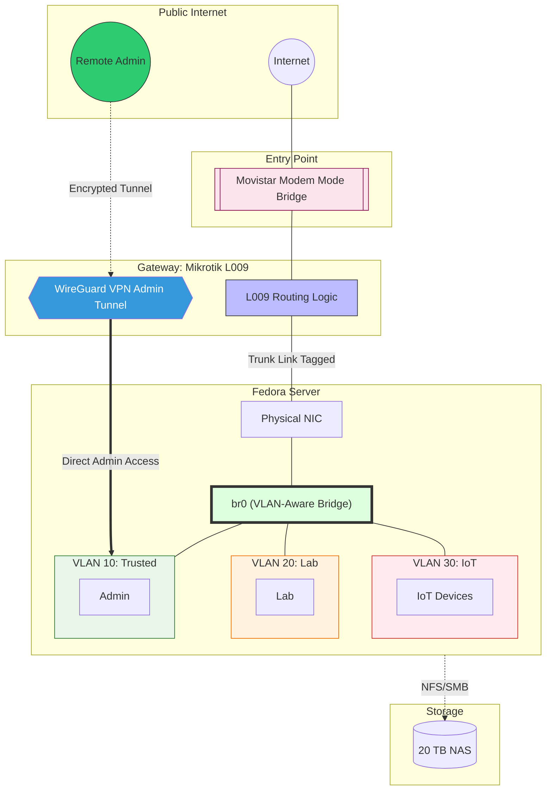
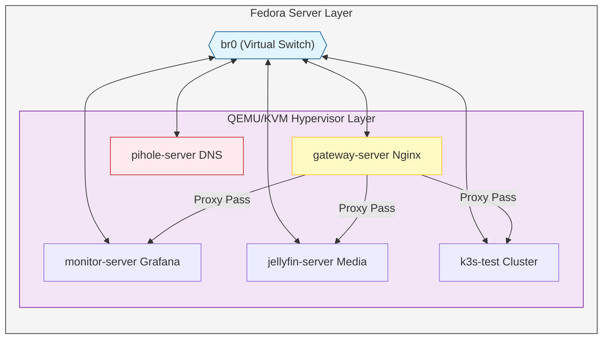

# Self-Hosted Infrastructure Lab


## About This Project

This repository documents a live, self-hosted infrastructure environment running on bare-metal hardware. It is built around security-first principles. Every layer, from network segmentation to service exposure, is deliberately designed and version-controlled.

A physical Fedora hypervisor runs QEMU/KVM virtual machines — each service in its own dedicated VM for isolation. A MikroTik router enforces VLAN segmentation, and WireGuard VPN provides secure remote access. Ansible automates the full deployment lifecycle from VM provisioning to service configuration.

Services include an Nginx reverse proxy gateway, Pi-hole for network-wide DNS filtering, Jellyfin as a self-hosted media server, and a K3s cluster for container orchestration. The Grafana Stack (Alloy, Loki, Grafana) alongside Uptime Kuma provide end-to-end observability. Incident reports document real operational problems encountered and resolved.

> **Mirror documentation.** This repository is a mirror of the configuration and documentation running on the live server. It reflects the actual state of the infrastructure as closely as possible, with configs, playbooks, and write-ups kept in sync with what is deployed in production.

> **Actively maintained.** This lab is continuously evolving — ongoing work focuses on security hardening, service availability.

## How to Navigate This Repo

Each top-level directory is self-contained and focused on a specific concern:

- Start with **`infrastructure/`** for an overview of how VMs are provisioned and how storage is organised.
- Read **`networking/`** to understand the VLAN layout, WireGuard setup, and jump-host design.
- See **`observability/`** for how logs and metrics are collected and visualised with the Grafana Stack (Alloy, Loki, Grafana).
- Browse **`automation/ansible/`** to explore the playbooks and inventory that tie everything together.
- Check **`incident-reports/`** for detailed write-ups of real operational problems encountered and how they were diagnosed and resolved.

---

## Stack & Components
- **Virtualisation:** QEMU/KVM on Fedora Server — each service runs in a dedicated VM for isolation
- **Automation:** Ansible for full lifecycle management (provisioning, config, deployment), Cloud-Init for VM bootstrap
- **Networking:** MikroTik RouterOS (VLANs, firewall), WireGuard VPN, Pi-hole for DNS filtering
- **Services:** Nginx reverse proxy, Jellyfin media server, K3s cluster — containerised with Docker
- **Observability:** Grafana Stack (Alloy, Loki, Grafana) and Uptime Kuma
- **Hardware:** CyberPower UPS monitoring for graceful shutdown

## Repository Structure

```
.
├── infrastructure/        # VM provisioning, storage, K3s, reverse proxy
├── networking/            # WireGuard VPN, MikroTik, jump-host architecture
├── observability/         # Grafana Stack (Alloy, Loki, Grafana), Uptime Kuma
├── automation/ansible/    # Playbooks, group_vars, and inventory for all deployments
└── incident-reports/      # Real-world debugging and resolution write-ups
```

## Network Architecture



## Services Architecture


