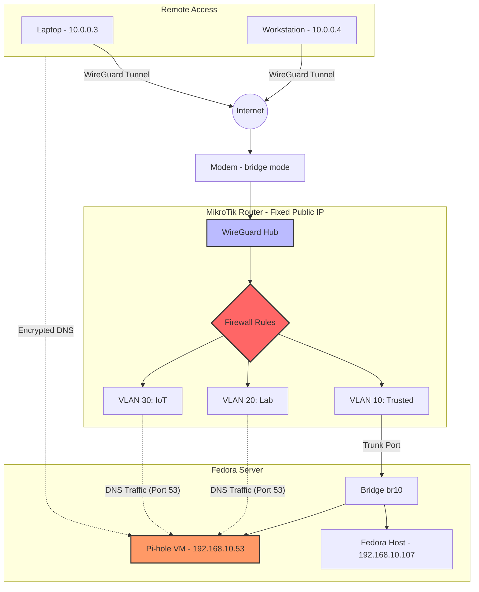

# Self-Hosted Infrastructure Lab


## About This Project

This repository documents a production-grade self-hosted infrastructure environment built to apply and demonstrate real-world Infrastructure and DevOps engineering. Every component — from VM provisioning to firewall hardening — is defined as code and follows patterns used in professional production environments.

The infrastructure is architected as a private enterprise-grade network: a physical Fedora hypervisor runs QEMU/KVM virtual machines, a MikroTik router enforces VLAN segmentation and WireGuard VPN access, and Ansible automates the full deployment lifecycle. Each service runs in its own dedicated VM for isolation and security — including a gateway VM running Nginx as a reverse proxy. Docker contains the individual service workloads, Pi-hole handles network-wide DNS filtering and manages local DNS records for all internal services, and Jellyfin runs as a self-hosted media server. A PLG stack (Promtail, Loki, Grafana) alongside Uptime Kuma provide end-to-end observability. Incident reports document real operational problems encountered and resolved.

> **Mirror documentation.** This repository is a mirror of the configuration and documentation running on the live server. It reflects the actual state of the infrastructure as closely as possible, with configs, playbooks, and write-ups kept in sync with what is deployed in production.

> **Work in progress.** This lab is actively evolving. Improving security hardening and service availability are the top ongoing priorities — expect to see continued work in those areas across the codebase.

## How to Navigate This Repo

Each top-level directory is self-contained and focused on a specific concern:

- Start with **`infrastructure/`** for an overview of how VMs are provisioned and how storage is organised.
- Read **`networking/`** to understand the VLAN layout, WireGuard setup, and jump-host design.
- See **`observability/`** for how logs and metrics are collected and visualised with the PLG stack.
- Browse **`automation/ansible/`** to explore the playbooks and inventory that tie everything together.
- Check **`incident-reports/`** for detailed write-ups of real operational problems encountered and how they were diagnosed and resolved.

> **A note on storage:** Persistent data is backed by a 20 TB NAS, which provides storage for VM disk images, media libraries, and service data volumes. None of this is tracked in the repository. The documentation in `infrastructure/` describes the storage layout (LVM thin pools, qcow2 images, bind-mount paths, NAS mounts) so the setup can be reproduced, but the data itself lives outside version control.

---

## Core Components
- **Hypervisor:** Fedora Server running QEMU/KVM VMs.
- **Automation:** Ansible playbooks for VM provisioning and service deployment.
- **Networking:** MikroTik RouterOS with VLAN segmentation and WireGuard VPN for secure remote access.
- **Observability:** PLG Stack (Promtail, Loki, Grafana) and Uptime Kuma for proactive monitoring.
- **Hardware Integration:** CyberPower UPS monitoring for graceful shutdown/power management.

## Tech Stack
- **OS:** Fedora Server (host and VMs)
- **Networking:** MikroTik (VLANs, Bridge, Firewall), WireGuard, RouterOS
- **DevOps:** Ansible, Docker, Cloud-Init
- **Monitoring:** Grafana, Loki, Promtail, Uptime Kuma
- **Security:** Pi-hole (DNS Filtering), Nginx Reverse Proxy

## Repository Structure

```
.
├── infrastructure/        # VM provisioning, storage, K3s, reverse proxy
├── networking/            # WireGuard VPN, MikroTik, jump-host architecture
├── observability/         # PLG stack (Prometheus/Loki/Grafana), Uptime Kuma
├── automation/ansible/    # Playbooks, group_vars, and inventory for all deployments
└── incident-reports/      # Real-world debugging and resolution write-ups
```

## Network Architecture


