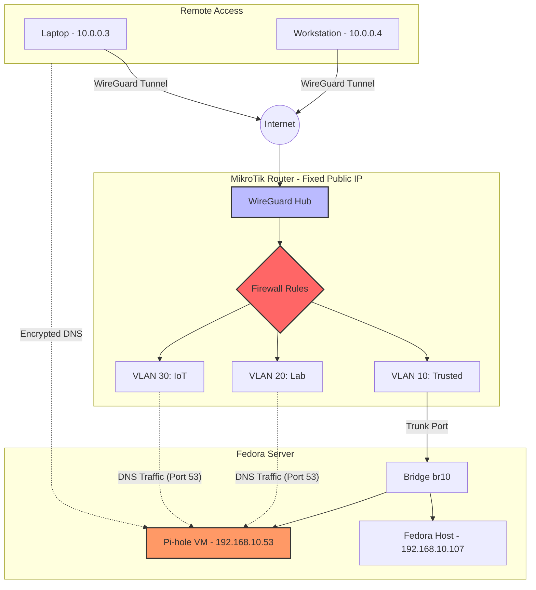

# Self-Hosted Infrastructure Lab


## About This Project

This repository documents a production-grade home lab built to practice real-world Infrastructure and DevOps engineering. Every component — from VM provisioning to firewall hardening — is defined as code and reflects patterns used in professional environments.

The lab simulates an enterprise network: a physical Fedora hypervisor runs QEMU/KVM virtual machines, a MikroTik router enforces VLAN segmentation and WireGuard VPN access, Ansible automates the full deployment lifecycle, and a PLG stack (Prometheus, Loki, Grafana) provides end-to-end observability. Incident reports document real problems encountered and resolved during the build.

---

## Core Components
- **Hypervisor:** Fedora Server running QEMU/KVM VMs.
- **Automation:** Ansible playbooks for VM provisioning and service deployment.
- **Networking:** MikroTik RouterOS with VLAN segmentation and WireGuard VPN for secure remote access.
- **Observability:** PLG Stack (Promtail, Loki, Grafana) and Uptime Kuma for proactive monitoring.
- **Hardware Integration:** CyberPower UPS monitoring for graceful shutdown/power management.

## Tech Stack
- **OS:** Fedora Server (host and VMs)
- **Networking:** MikroTik (VLANs, Bridge, Firewall), WireGuard, RouterOS
- **DevOps:** Ansible, Docker, Cloud-Init
- **Monitoring:** Grafana, Loki, Promtail, Uptime Kuma
- **Security:** Pi-hole (DNS Filtering), Nginx Reverse Proxy

## Repository Structure

```
.
├── infrastructure/        # VM provisioning, storage, K3s, reverse proxy
├── networking/            # WireGuard VPN, MikroTik, jump-host architecture
├── observability/         # PLG stack (Prometheus/Loki/Grafana), Uptime Kuma
├── automation/ansible/    # Playbooks, group_vars, and inventory for all deployments
└── incident-reports/      # Real-world debugging and resolution write-ups
```

## Network Architecture


