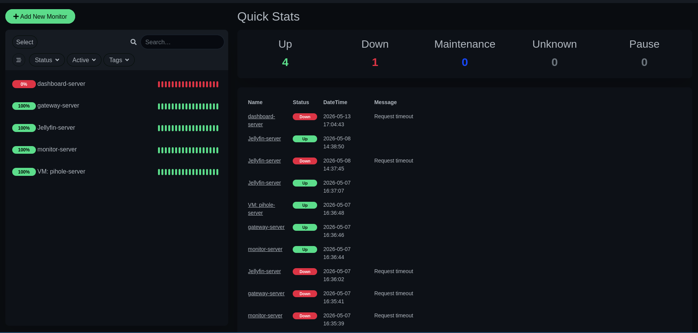
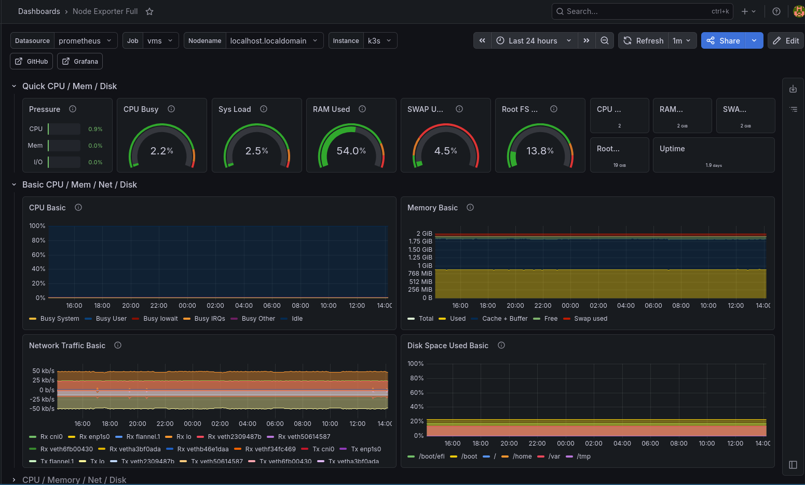
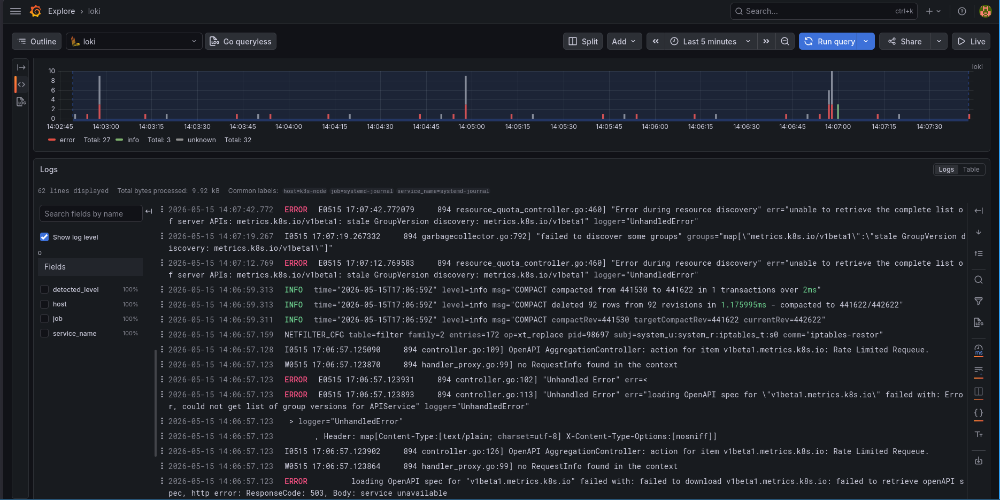
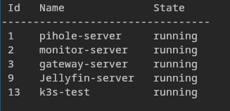

# Observability Stack Test.

This document outlines how our monitoring tools interact and how we can diagnose a False Down state using our multi-layered observability stack.

## 1. The Conflict: External vs. Internal Status

Currently, we are seeing a discrepancy in the reporting of the **dashboard-server (k3s-test)**.

*   **Uptime Kuma (External Perspective):** Reports the service as **DOWN (0%)**. The message indicates a `Request timeout`. This tells us that the specific heartbeat or URL endpoint Uptime Kuma is tracking is unreachable from the monitoring node.
*   **CLI & Grafana (Infrastructure Perspective):** The server is confirmed as **running**.
    *   The CLI shows `k3s-test` in a `running` state (Id 13).
    *   Grafana Metrics show an uptime of **1.9 days** with active CPU (2.2%) and RAM (54%) utilization.

## 2. Layered Observability Explanation

Our stack is designed to catch failures at different levels of the OSI model. Here is how each image explains a different part of the story:

### Layer 1: Availability Monitoring (Uptime Kuma)
*   **Role:** User-facing availability.
*   **What it tells us here:** Even though the VM is "on," the service is "down" for the end-user. The `Request timeout` suggests a network routing issue, a firewall block, or the web service itself failing to respond to external pings.

### Layer 2: Infrastructure Metrics (Grafana + Prometheus)
*   **Role:** Health and resource consumption.
*   **What it tells us here:** The VM is healthy. We can see steady network traffic, disk space usage, and memory allocation. Since metrics are flowing into Grafana, we know the `node-exporter` is working and the Prometheus scrape job is successful. This proves the **Network Layer is partially functional**, but the **Application Layer (Dashboard) is not**.

### Layer 3: Log Aggregation (Grafana + Loki)
*   **Role:** Error diagnosis and "The Why."
*   **What it tells us here:** This is the "Smoking Gun." The logs show critical errors:
    *   `"Error during resource discovery"`
    *   `"stale GroupVersion discovery: metrics.k8s.io/v1beta1"`
    *   `"ResponseCode: 503, Body: service unavailable"`
*   **The Diagnosis:** The K3s control plane is struggling to discover its own metrics API. The `dashboard-server` likely relies on these APIs to render. Because the internal Kubernetes API is returning a 503, the dashboard service is likely crashing or refusing connections, leading to the **Request timeout** seen in Uptime Kuma.

### Layer 4: State Validation (CLI)
*   **Role:** Physical/Virtual machine reality check.
*   **What it tells us here:** Confirms that the hypervisor/runtime has not killed the process. The VM/Container exists and is executing code.

---

## 3. Summary of Findings

| Tool | Status | Meaning |
| :--- | :--- | :--- |
| **Uptime Kuma** | **DOWN** | The external endpoint is unreachable. |
| **Grafana Metrics** | **UP** | The VM is alive and consuming resources. |
| **Loki Logs** | **ERROR** | Internal K8s API services (metrics.k8s.io) are failing. |
| **CLI** | **RUNNING** | The instance is powered on. |

**Conclusion:** 
Our observability stack is working exactly as intended. While one tool says "Down" and another says "Up," they are both correct. The **VM is Up**, but the **Service is Down**. 

