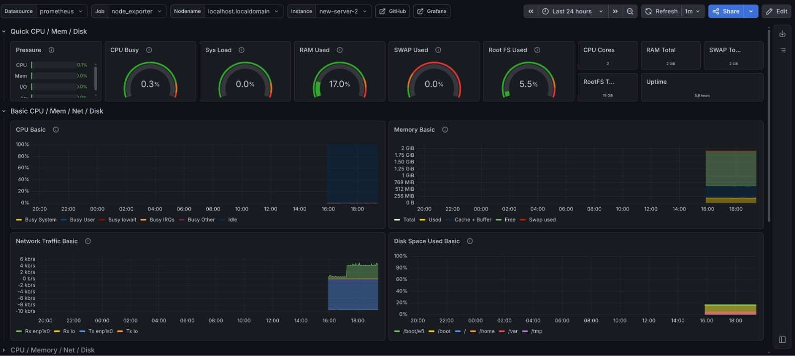

# Observability & Monitoring: PLG Stack

## 1. Architecture Overview
The monitoring stack follows a **pull-based architecture**:

- **Monitoring Host:** A dedicated Fedora VM (`192.168.10.200`) running Prometheus and Grafana via Docker.
- **Agents:** Every node in the fleet (Physical Host + KVM Guest VMs) runs `node-exporter` on port **9100**.
- **Scraper:** Prometheus polls these nodes every 15 seconds to collect system metrics (CPU, RAM, Disk, Network).
- **Logs:** Promtail agents on each VM ship logs to Loki on the Monitor VM.

| Component | Role | Port |
| :--- | :--- | :--- |
| Prometheus | Metrics scraper | `9090` |
| Loki | Log aggregation | `3100` |
| Grafana | Visualization | `3000` |
| Promtail | Log agent (per VM) | `9080` |
| node-exporter | System metrics agent (per VM) | `9100` |

---

## 2. Automated Node Setup (Day Zero)
Monitoring is baked into the VM deployment via Ansible and Cloud-Init. Every new VM is automatically provisioned with the monitoring agent.

### Cloud-Init Configuration (user-data)
```yaml
packages:
  - firewalld
  - prometheus-node-exporter

runcmd:
  - [ systemctl, enable, --now, firewalld ]
  - [ systemctl, enable, --now, prometheus-node-exporter ]
  - [ firewall-cmd, --permanent, --add-port=9100/tcp ]
  - [ firewall-cmd, --reload ]
```

---

## 3. Prometheus Configuration
The Prometheus scrape config uses **static_configs** with **labels** to provide friendly instance names.

**Location:** `/opt/prometheus/prometheus.yml` (Monitor VM)
```yaml
scrape_configs:
  - job_name: 'node_exporter'
    static_configs:
      - targets: ['192.168.10.221:9100']
        labels:
          instance: 'new-server-1'
      - targets: ['192.168.10.222:9100']
        labels:
          instance: 'new-server-2'
      - targets: ['10.0.0.2:9100']
        labels:
          instance: 'fedora-host'
```

After editing: `sudo docker restart prometheus`

---

## 4. Grafana Dashboard
- **Dashboard ID 1860 (Node Exporter Full):** The primary "deep dive" view for per-node performance troubleshooting.

---

## 5. Lessons Learned & Troubleshooting

- **Shell Interference:** Fedora's Fish shell can interfere with Ansible's JSON communication. For automation, target hosts should use `/usr/bin/bash` and `~/.hushlogin` to silence login banners.
- **Package Naming:** On Fedora 41, the node exporter package is `prometheus-node-exporter`.
- **Network Interface Names:** Use MAC-address matching in Cloud-Init `network-config` to avoid issues with dynamic interface naming (`eth0` vs `enp1s0`).
- **Static ARP:** On a Linux bridge (`br10`), static ARP entries (`arp -s <IP> <MAC>`) on the host ensure stable connectivity between the monitoring VM and target guests.

---

## Verification
```bash
curl <TARGET_IP>:9100/metrics | head -n 10
```


